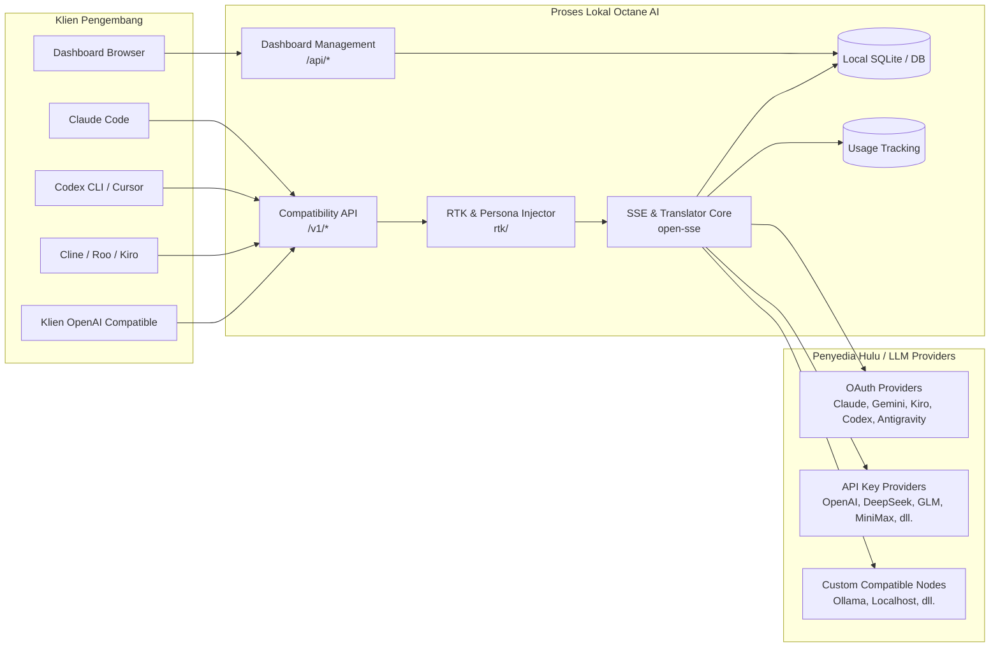

# Arsitektur Octane AI (9Router)

Dokumen ini menjelaskan struktur arsitektur sistem, alur pemrosesan request, dan komponen utama Octane AI.

## Ringkasan Eksekutif

Octane AI adalah gateway proxy AI lokal dan dashboard manajemen berbasis Next.js dan Node.js. Sistem ini menyediakan antarmuka API yang kompatibel dengan OpenAI (`/v1/*`), Claude (`/v1/messages`), dan Responses API, lalu merutekan permintaan ke berbagai penyedia LLM upstream dengan kemampuan translasi format pesan secara real-time, pengelolaan multi-akun, fallback otomatis, serta pelacakan penggunaan token.

### Fitur Utama

- **Single API Surface**: Kompatibilitas multi-format untuk klien AI (Claude Code, Cursor, Codex CLI, Cline, Roo, Antigravity, dll.).
- **Mesin Translasi Real-time (`open-sse`)**: Mengonversi pesan dan chunk SSE antar format provider yang berbeda secara transparan.
- **Account & Combo Fallback**: Failover otomatis antar-akun dan antar-model jika terjadi pembatasan kuota atau error dari upstream.
- **RTK (Request Token Killer)**: Kompresi cerdas pada tool results dan payload percakapan panjang untuk menghemat token dan context window.
- **Persona Injector**: Injeksi persona model secara modular (seperti BOZ-GEMINI dan BOZ-MUSE).
- **Manajemen Kredensial**: Dukungan multi-koneksi berbasis API Key, token OAuth, dan sinkronisasi status akun.

---

## Diagram Sistem Tingkat Tinggi

---

## Komponen Utama Runtime

### 1. Lapisan API & Rute Kompatibilitas (`src/app/api/*`)
- `/api/v1/chat/completions`: Rute utama untuk chat kompatibel OpenAI.
- `/api/v1/messages`: Rute kompatibel Claude Anthropic Messages.
- `/api/v1/responses`: Rute kompatibel OpenAI Codex Responses.
- `/api/v1/models`: Katalog daftar model gabungan yang tersedia.
- Rute Manajemen: Manajemen koneksi provider (`/api/providers*`), API keys (`/api/keys*`), model aliases, combos, dan preferensi dashboard.

### 2. Mesin Streaming & Translasi (`open-sse/`)
Alur kerja pemrosesan request chat:
1. **Model Resolution**: Mengurai alias model (`parseModel`) ke pasangan `provider/model`.
2. **Pre-Translate Hooks (`rtk/`)**:
   - Kompresi payload hasil alat (`tool_result`) secara in-place.
   - Pengecekan persona aktif (misal `BOZ-GEMINI` atau `BOZ-MUSE`) melalui `caveman.js` / injector persona.
3. **Executor Dispatch**: Memilih executor yang cocok (`getExecutor(provider)`). Menggunakan `DefaultExecutor` untuk provider OpenAI-compatible atau executor khusus (misal `kiro`, `cursor`, `antigravity`, `codex`).
4. **Request Translation**: Mentranslasi format input klien ke format yang diharapkan oleh provider upstream melalui format OpenAI sebagai jembatan atau direct route.
5. **Streaming Execution**: Menghubungi provider upstream dan membaca chunk respon SSE secara real-time.
6. **Response Translation**: Mengubah chunk SSE dari format provider kembali ke format yang dipahami klien.
7. **Usage Tracking**: Menghitung dan menyimpan ringkasan token prompt/completion ke database lokal.

### 3. Ketahanan & Penanganan Kesalahan (Failover)
- **Account Cooldown**: Jika satu akun koneksi terkena rate limit (429) atau error sementara, sistem menandai akun tersebut untuk istirahat sementara (cooldown) dan mengalihkan request ke akun lain.
- **Combo Fallback**: Jika seluruh akun untuk satu model tidak tersedia, sistem beralih ke model berikutnya dalam urutan combo.
- **Token Refresh**: Token OAuth (Claude, Gemini, Antigravity, dll.) disegarkan secara otomatis sebelum kadaluarsa atau saat menerima respon 401/403.

---

## Peta Direktori

- `open-sse/` — Mesin inti streaming, eksekusi upstream, dan translasi format.
- `src/` — Aplikasi Next.js untuk dashboard frontend dan API endpoint.
- `cli/` — Perkakas CLI Node.js lokal.
- `tests/` — Test suite Vitest (`tests/translator/` dan integrasi).
- `docs/agents/` — Konfigurasi agen AI (issue tracker, domain docs, triage labels).
- `docs/adr/` — Rekaman keputusan arsitektur (Architecture Decision Records).

---

## Perintah Verifikasi & Testing

- Menjalankan test translasi: `npx vitest run --config tests/vitest.config.js`
- Menjalankan dev server: `npm run dev`
- Membangun aplikasi: `npm run build`
